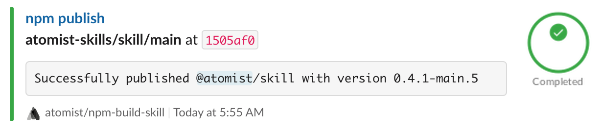

If you develop web applications or services running on Node.js, you want to make
sure your code builds and passes tests. This skill will build and test your code
on every push of commits or tags.

When writing JavaScript, or any one of the numerous languages that transpile
into JavaScript, sooner or later you develop code that you want to use in
multiple projects. The solution is to create and publish an npm package. This
skill is also able to create and publish your code as an npm package to either
the default npm.js registry or your own, private registry.

This skill supports the follow features:

-   Set up this skill with multiple configurations to run your tests on
    different versions of Node.js and npm
-   Configure the build to match _your_ desired workflow
-   Provide a consistent build configuration across _all_ your projects
-   Optionally publish both public and restricted packages to a variety of npm
    registries
-   Install the custom tools needed for your build and test to complete
    successfully
-   Create custom npm dist tags
-   Cache files from build to build
-   Trigger npm builds on pushes of commits and/or tags

### Build and publish an npm package

