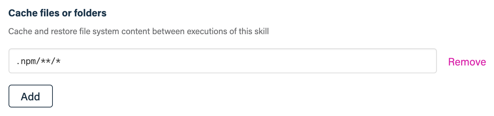

## Before you get started

Connect and configure these integrations:

1.  [**GitHub**][github] _(required)_
2.  [**npm Registry**][npm] _(optional)_
3.  [**Slack**][slack] or [**Microsoft Teams**][msteams] _(optional)_

[github]: https://go.atomist.com/catalog/integration/github "GitHub Integration"
[npm]:
    https://go.atomist.com/catalog/integration/npmjs-registry
    "npm Registry Integration"
[slack]: https://go.atomist.com/catalog/integration/slack "Slack Integration"
[msteams]:
    https://go.atomist.com/catalog/integration/microsoft-teams
    "Microsoft Teams Integration"

## How to configure

1.  **NPM Registry**

    

    Select the npm registry from the list of available registries. If you have
    not already configured an npm registry, only your GitHub organizations, via
    the GitHub Packages npm registry, will appear in the list.

2.  **Triggers**

    

    Select the events that will trigger execution of the skill. You can select
    GitHub pushes, GitHub tags, or both.

3.  **npm scripts to run**

    

    Provide the name of the npm scripts from the project's `package.json`
    scripts section. This can be useful if you package needs compiled, tested,
    or otherwise transformed before being published. Only provide the name of
    the script, not the full `npm run SCRIPT` command. The order in which the
    scripts are specified is the order in which they will get executed. If one
    script fails, the execution stops. Scripts are run using
    `npm run --if-present SCRIPT`, so it is safe to include scripts that are
    only present in some of your packages.

4.  **Node.js version**

    

    Provide a valid Node.js version or alias as used by
    [nvm](https://github.com/nvm-sh/nvm#usage), e.g., `12.3.1` or `14`.

5.  **Publish package**

    

    When checked, the skill will run `npm publish` after successful execution of
    the configured scripts. This will create the package and publish it to the
    configured npm registry. If not checked, the package will not be published.

    _You must have an npm registry configured to publish packages._

6.  **Package access**

    

    `npm publish` allows to publish packages with `public` or `restricted`
    access.

7.  **Create additional npm distribution tags**

    

    Specify additional [distribution tags][dist-tag] like `next` or `stable` for
    the published version of the package. In addition to the tags you specify
    here, if the skill is running on the default branch, it adds the `next` tag.
    Similarly, if the skill is running on a git tag that looks like a release
    [semantic version][semver], the `latest` tag is added, making the published
    version the new default.

8.  **Specify an optional bash command**

    

    In case your npm scripts need different tools - like databases - you can use
    this parameter to install such tools. Provide a command that can in a Ubuntu
    20.04 LTS container. This command is after the code is checked out but
    before Node.js is setup or any npm commands are run.

    Here's is an example on how to install MongoDB and start it:

    ```bash
    apt-get update \
        && apt-get install -y wget libcurl4 openssl tar \
        && wget https://fastdl.mongodb.org/linux/mongodb-linux-x86_64-ubuntu1804-4.2.8.tgz \
        && tar -zxvf mongodb-linux-x86_64-ubuntu1804-4.2.8.tgz \
        && cp mongodb-linux-x86_64-ubuntu1804-4.2.8/bin/* /usr/local/bin/ \
        && rm -rf mongodb-linux-x86_64-ubuntu1804-4.2.8* \
        && mkdir -p /var/lib/mongo \
        && mkdir -p /var/log/mongodb \
        && mongod --dbpath /var/lib/mongo --logpath /var/log/mongodb/mongod.log --fork
    ```

9.  **Enable file caching for faster execution times**

    

    You can speed up executions times by enabling file caching for certain
    artifacts — for example, dependencies — by providing glob patterns of files
    you'd like to cache between executions.

    Note that only files within the `/atm/home` directory can be cached.

    Caching the npm dependency cache could be accomplished with the pattern
    `.npm/**/*`.

10. **Determine repository scope**

    

    By default, this skill will be enabled for all repositories in all
    organizations you have connected.

    To restrict the organizations or specific repositories on which the skill
    will run, you can explicitly choose organization(s) and repositories.

11. **Activate the skill**

    Save your configuration and activate the skill by clicking the "Enable
    skill" button.

[dist-tag]: https://docs.npmjs.com/adding-dist-tags-to-packages "npm dist-tags"
[semver]: https://semver.org/ "Semantic Versioning"
